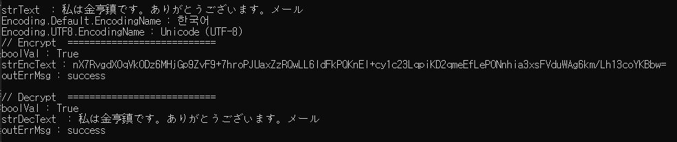

# CryptoNetCom Com+ 
SEED ECB/CBC MODE Encrypt/Decrypt Component

## 1. 프로젝트 정보 및 버젼

### *[ CryptoNetCom Solution ]	
### *[ CryptoNetCom.csproj ]	

| 프로젝트 | 설명 | .NET버젼 | CryptoNetCom버젼 |
| -------- | -------- | -------- | -------- |
| CryptoNetCom | SEED Encrypt/Decrypt 1.0	| .NET 3.5	| CryptoNetCom 1.0.0.0 |

## 2. CryptoNetCom 정보 및 참조
- SEED 암/복호화 모듈 ECB/CBC MODE
- CryptoNetCom.dll 1.0.0.0
- System.EnterpriseServices

## 3. CryptoNetCom 컴포넌트 등록
* 구성요소서비스 > COM+ 응용프로그램 > CryptoNetCom.dll 컴포넌트 등록

## 4. CryptoNetCom Class Description
- /Doc/CryptoNetCom모듈.xls

* 5. CryptoNetCom CryptLib Class :
```
public bool SeedEncrypt(string strKey, string strText, out string outVal, out string outErrMsg)
public bool SeedDecrypt(string strKey, string strEnc, out string outVal, out string outErrMsg)
public bool SeedECBEncrypt(string strKey, string strIV, string strText, out string outVal, out string outErrMsg)
public bool SeedECBDecrypt(string strKey, string strIV, string strEnc, out string outVal, out string outErrMsg)
public bool SeedECBPADEncrypt(string strKey, string strIV, string strText, out string outVal, out string outErrMsg)
public bool SeedECBPADDecrypt(string strKey, string strIV, string strEnc, out string outVal, out string outErrMsg)
public bool SeedCBCEncrypt(string strKey, string strIV, string strText, out string outVal, out string outErrMsg)
public bool SeedCBCDecrypt(string strKey, string strIV, string strEnc, out string outVal, out string outErrMsg)
public bool SeedCBCPADEncrypt(string strKey, string strIV, string strText, out string outVal, out string outErrMsg)
public bool SeedCBCPADDecrypt(string strKey, string strIV, string strEnc, out string outVal, out string outErrMsg)
```

## 5. Unit Test Sample
```
Option Explicit 

Call SeedCBCTest()

Sub SeedCBCTest()

	Dim objCom, retVal
	Dim SEEDKEY, SEEDIV, strText, strEnc, strDec
	Dim outVal, ErrMsg
	Dim strMsgBox
	

	SEEDKEY = "DevOpsFlux1580!@"
	SEEDIV = "2019GoodLuck1234"
	strText = "Test0987SeedCBCTest"

	strMsgBox = "strText : " & strText & vbCrLf

	Set objCom = CreateObject("CryptoNetCom.CryptLib")
	retVal = objCom.SeedCBCPADEncrypt(SEEDKEY, SEEDIV, strText, outVal, ErrMsg)
	strEnc = outVal
	'strMsgBox = strMsgBox & "seedEncrypt : " & strEnc & " ____ " & ErrMsg  & vbCrLf
	strMsgBox = strMsgBox & "seedEncrypt : " & strEnc & vbCrLf

	retVal = objCom.SeedCBCPADDecrypt(SEEDKEY, SEEDIV, strEnc, outVal, ErrMsg)
	strDec = outVal
	strMsgBox = strMsgBox & "SeedDecrypt : " & strDec & vbCrLf
	msgBox strMsgBox
	
	Set objCom = Nothing 
	
End Sub

```


## ISSUE : Global Language 
- CryptSeed.cs > line : 1307 / 1312
```
	다국어 UTF-8 변경 필요 시 
	//byte[] bValue = Encoding.Default.GetBytes(sValue);
	byte[] bValue = Encoding.UTF8.GetBytes(sValue);

	//sReturn = Encoding.Default.GetString(dec);
	sReturn = Encoding.UTF8.GetString(dec);
```
